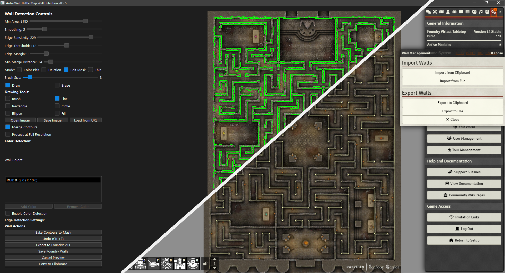

# Auto-Wall


**Auto-Wall** is a powerful tool for processing battle maps for virtual tabletop games. It automatically detects walls and obstacles in your maps and converts them into VTT-compatible wall data.



[](https://github.com/ThreeHats/auto-wall/releases)
[](https://opensource.org/licenses/MIT)

[Discord server](https://discord.gg/HUzEnZy8uJ)

## Features

### Automated Wall Detection
- **Edge Detection**: Automatically finds walls using edge detection algorithms
- **Color-Based Detection**: Extract walls based on specific colors
- **Adjustable Parameters**: Fine-tune detection sensitivity and results
- **High-Resolution Processing**: Option to process at full resolution for more accurate results

### Editing and Refinement
- **Interactive Deletion**: Click to remove unwanted walls
- **Color Picking**: Extract colors directly from the map for better detection
- **Mask Editing**: Draw or erase walls manually with various drawing tools
- **Wall Thinning**: Automatically reduce wall thickness for cleaner results
- **Contour Merging**: Connect and simplify wall segments

### Foundry VTT Integration (others to come?)
- **Companion Foundry Module**: Install the [Auto Wall Companion](https://github.com/ThreeHats/auto-wall-companion) module for import/export of walls and map image
- **Direct JSON Export**: Create wall data compatible with Foundry VTT
- **Optimization Options**: Control wall segment length and density
- **Grid Snapping**: Option to snap walls to grid intersections
- **Preview System**: See how walls will look before exporting

## Installation

### Windows Executable
1. Download the latest release from the [Releases page](https://github.com/ThreeHats/auto-wall/releases)
2. Run `Auto-Wall.exe`

### From Source
1. Clone the repository:
   ```
   git clone https://github.com/ThreeHats/auto-wall.git
   ```

2. Install dependencies:
   ```
   cd auto-wall
   pip install -r requirements.txt
   ```

3. Run the application:
   ```
   python auto_wall.py
   ```

## Quick Start Guide

1. **Open an image**: Click "Open Image" or "Load from URL" to import your battle map
2. **Pick detection mode**:
   - For maps with clear lines, use edge detection (default)
   - For maps with with distinct colors for the walls or background, enable "Color Detection" and select colors
3. **Fine-tune results**: Use the sliders to adjust detection sensitivity
4. **Clean up walls**: Switch to "Deletion" mode and select on unwanted walls
5. **Bake the mask**: Click "Bake Contours to Mask", and use the drawing tools to make any final adjustments
6. **Export to Foundry**: Click "Export to Foundry VTT" to generate wall data

## Usage Guide

### Detection Modes

#### Edge Detection (Default)
Best for maps with clear wall lines:
- **Edge Sensitivity & Edge Threshold**: Controls edge detection precision - higher sensitivity finds more edges, higher threshold filters out noise
- **Min Area**: Filter out small artifacts
- **Smoothing**: Reduce noise (higher values = more smoothing)
- **Edge Margin**: Exclude detection near image edges

#### Color Detection
Best for maps with distinct colors for the walls or background:
1. Enable "Color Detection"
2. Add colors by:
   - Clicking "Add Color" and selecting from color picker
   - Using "Color Pick" mode to select colors directly from the image
3. Adjust threshold for each color to control matching sensitivity

### Editing Tools

#### Deletion Mode
- Click on walls to remove them
- Drag to select and delete multiple walls

#### Edit Mask Mode
Edit the "baked" mask layer:
- **Draw/Erase**: Toggle between adding and removing walls
- **Brush Size**: Control the size of your editing tool
- **Tools**: Choose between brush, line, rectangle, circle, ellipse, or fill tool

#### Thinning Mode
Reduces wall thickness:
- Select thick walls to thin them
- Adjust target width and iteration count for desired results

### Exporting to Foundry VTT

1. Click "Export to Foundry VTT"
2. Configure export settings:
   - **Simplification Tolerance**: Controls how much wall details are simplified (0 = full detail)
   - **Maximum Wall Segment Length**: Limits how long each wall segment can be
   - **Maximum Number of Generation Points**: Caps the total number of generated points for performance
   - **Point Merge Distance**: Connects nearby wall endpoints to fix gaps and lessen the number of walls
   - **Angle Tolerance**: Determines when walls at different angles should merge
   - **Maximum Straight Gap to Connect**: Maximum distance to bridge between straight nearby walls
   - **Grid Snapping**: Optional alignment to a grid for precise positioning

3. Preview the results
4. Save or copy the wall data to clipboard

## Building from Source

To create an executable:

1. Ensure PyInstaller is installed: `pip install pyinstaller`
2. Run the build script: `build.bat`
3. Find the executable in the `dist` folder

## Contributing

Contributions are welcome! Please feel free to:

1. Report bugs and request features using the issue tracker
2. Submit pull requests with fixes and improvements
3. Suggest new detection algorithms or optimizations

## License

Auto-Wall is licensed under the MIT License. See [LICENSE](LICENSE) for details.

## Acknowledgments

- Uses [OpenCV](https://opencv.org/) for image processing
- Uses [scikit-learn](https://scikit-learn.org/) for color clustering
- Uses [PyQt6](https://www.riverbankcomputing.com/software/pyqt/) for the user interface

---

*Made with ❤️ for the TTRPG community*
